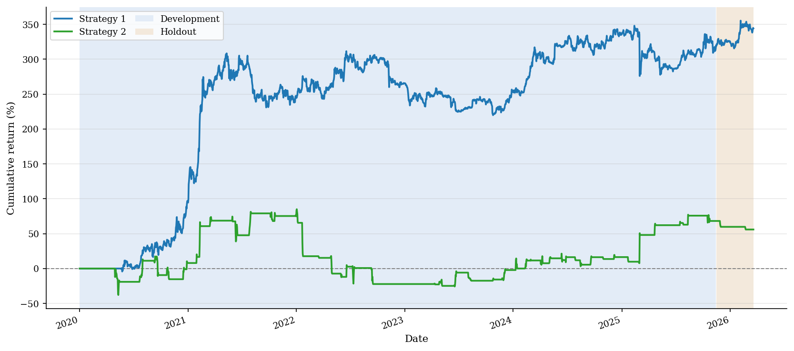

# Systematic Cryptocurrency Research

[](https://github.com/PeterLP123/systematic-crypto-research/actions/workflows/ci.yml)


A cost-aware empirical comparison of two systematic cryptocurrency strategies: multi-asset trend following and BTC-dominance mean reversion. The project uses walk-forward model selection, an untouched holdout, realistic turnover accounting, and the Abdi-Ranaldo spread estimator.

[Read the final report](report/final_report.pdf) · [Explore the research notebook](notebooks/strategy_analysis.ipynb)



## Research question

Can two economically distinct crypto signals retain useful risk-adjusted performance after stable parameter selection, realistic transaction costs, and an untouched out-of-sample test?

- **Strategy 1 - trend following:** volatility-normalised moving-average signals across BTC, ETH, BNB, and ADA, with Ledoit-Wolf covariance estimation and constrained mean-variance sizing.
- **Strategy 2 - BTC-dominance mean reversion:** an equal-weight altcoin basket entered after extreme increases in BTC's share of aggregate Binance notional volume.

The sample contains 2,271 daily observations from 1 January 2020 to 20 March 2026. Strategy parameters are selected before evaluating the final 126 daily observations.

## Main results

| Metric | Strategy 1 IS | Strategy 1 OOS | Strategy 2 IS | Strategy 2 OOS |
|---|---:|---:|---:|---:|
| Sharpe ratio | 0.923 | **1.300** | 0.343 | **-2.912** |
| Annualised return | 18.38% | **12.56%** | 6.30% | **-14.00%** |
| Maximum drawdown | -22.3% | **-3.8%** | -59.9% | **-7.3%** |
| Net PnL | $31,903 | **$2,431** | $6,818 | **-$1,222** |
| Active days | 93.5% | **100.0%** | 9.0% | **2.4%** |

Strategy 1 retained positive holdout performance and shallow drawdown, although its holdout exposure was heavily concentrated in BTC. Strategy 2 failed its holdout: only two out-of-sample trades occurred, so the negative result is both economically important and statistically weak. The repository preserves that result rather than retuning after seeing the holdout.

## Methodology

1. Download daily Binance OHLCV data with `ccxt` and audit candle integrity.
2. Align asset returns with the FRED Effective Federal Funds Rate.
3. Reserve an untouched 126-day holdout before model selection.
4. Select Strategy 1 parameters with expanding walk-forward folds and a stability-penalised Sharpe score.
5. Tune Strategy 2 with Optuna's TPE sampler on the development sample only.
6. Apply lagged Abdi-Ranaldo half-spread estimates to traded notional.
7. Report gross and net PnL, turnover, drawdown, activity, and holdout performance.

## Repository structure

```text
.
├── notebooks/
│   └── strategy_analysis.ipynb      # complete research workflow and saved outputs
├── report/
│   ├── final_report.pdf             # compiled six-page report
│   ├── final_report.tex             # report source
│   ├── references.bib
│   └── figures/                     # curated report and README figures
├── tests/
│   └── test_pipelines.py            # deterministic pipeline smoke tests
├── strategy_helpers.py              # data quality and shared utilities
├── wf_trend_pipeline.py             # Strategy 1 implementation
├── strategy2_pipeline.py            # Strategy 2 implementation
├── recompute_gross_turnover.py      # independent PnL/turnover reconciliation
├── requirements.txt
└── CITATION.cff
```

Raw data, API credentials, Optuna databases, caches, and generated notebook output are intentionally excluded from Git.

## Setup

Python 3.12 is recommended.

```bash
git clone https://github.com/PeterLP123/systematic-crypto-research.git
cd systematic-crypto-research

python3.12 -m venv .venv
source .venv/bin/activate
python -m pip install --upgrade pip
python -m pip install -r requirements.txt

cp .env.example .env
jupyter lab notebooks/strategy_analysis.ipynb
```

The notebook is cache-first so a presentation rerun does not silently replace the experiment. For a clean-clone refresh:

1. add a [FRED API key](https://fred.stlouisfed.org/docs/api/api_key.html) to `.env`;
2. set the relevant `REFRESH_S1_DATA`, `REFRESH_FRED_DATA`, and `REFRESH_S2_CACHE` flags in the first code cell;
3. run Jupyter from the repository root so module imports and data paths resolve correctly.

Binance and FRED data are not redistributed in this repository. Availability and access restrictions can vary by location.

## Validation

Run the deterministic checks without downloading market data:

```bash
python -m pip install -r requirements-dev.txt
python -m pytest -q
```

Build the report with a TeX Live installation:

```bash
cd report
latexmk -pdf -interaction=nonstopmode -halt-on-error final_report.tex
```

The full notebook is substantially slower and requires either the local caches or live data refreshes described above.

## Limitations

- This is a historical coursework study, not a live trading system.
- Binance notional-volume share is a proxy for BTC dominance, not total-market-cap dominance.
- The final holdout is short, and Strategy 2 produces only two holdout trades.
- Fees, market impact, funding, borrow constraints, taxes, and operational risk are not modelled in full.
- Strategy 1's positive holdout result is concentrated in BTC and should not be interpreted as broad cross-asset validation.

## Report and citation

The final UCL COMP0051 report is available as both [PDF](report/final_report.pdf) and [LaTeX source](report/final_report.tex). Citation metadata is provided in [`CITATION.cff`](CITATION.cff).

## Disclaimer

This repository is for educational and research purposes only. It is not investment advice, and the reported backtests do not represent live performance.
