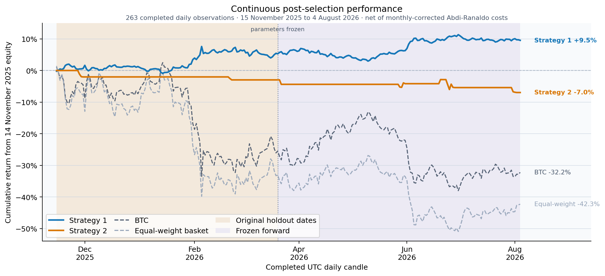
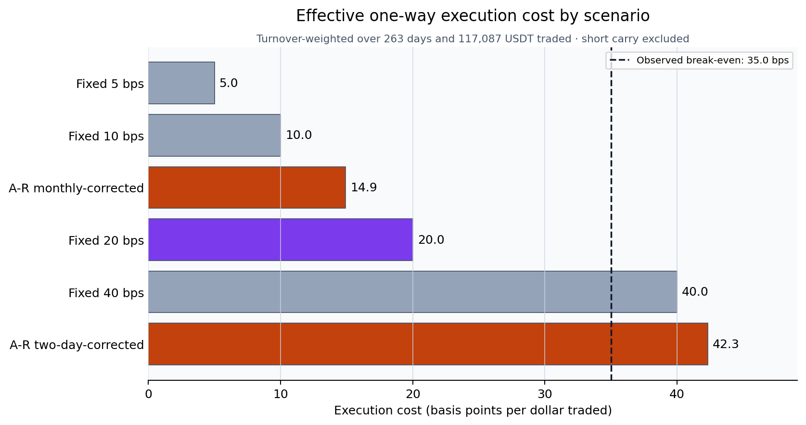
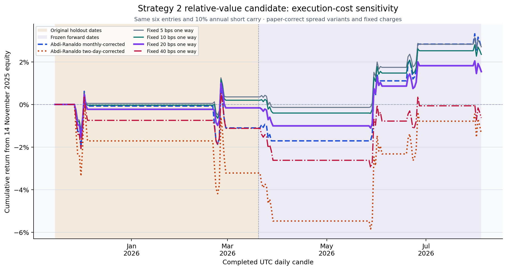

# Systematic Cryptocurrency Research

[](https://github.com/PeterLP123/systematic-crypto-research/actions/workflows/ci.yml)


[](LICENSE)

A cost-aware empirical comparison of two systematic cryptocurrency strategies: multi-asset trend following and BTC-dominance mean reversion. The project uses walk-forward model selection, an untouched holdout, realistic turnover accounting, and paper-corrected Abdi-Ranaldo spread estimates.

[Read the final report](report/final_report.pdf) · [Explore the research notebook](notebooks/strategy_analysis.ipynb)

## Portfolio takeaway

This repository demonstrates an end-to-end quantitative research workflow: audited market data,
leakage-aware model selection, reusable Python backtest pipelines, realistic cost accounting,
deterministic tests, and parameter-frozen forward monitoring. The result is deliberately
asymmetric: trend following held up through 263 continuous post-selection observations, while
BTC-dominance mean reversion failed; the failed strategy is preserved rather than retuned.



The chart rebases every series to the 14 November 2025 pre-window equity and follows the complete
263-day post-selection period. Shading separates the original holdout dates from the later
frozen-forward observations, and the dotted line marks the formal parameter freeze. Both strategies
retain their submitted specifications; no observation in this chart was used for retuning.

## Research question

Can two economically distinct crypto signals retain useful risk-adjusted performance after stable parameter selection, realistic transaction costs, and an untouched out-of-sample test?

- **Strategy 1 - trend following:** volatility-normalised moving-average signals across BTC, ETH, BNB, and ADA, with Ledoit-Wolf covariance estimation and constrained mean-variance sizing.
- **Strategy 2 - BTC-dominance mean reversion:** an equal-weight altcoin basket entered after extreme increases in BTC's share of aggregate Binance notional volume.

The raw sample contains 2,271 daily candles from 1 January 2020 to 20 March 2026; the return-aligned strategy panel begins on 2 January. Strategy parameters are selected before evaluating the final 126 daily observations.

## Original submitted results

| Metric | Strategy 1 IS | Strategy 1 OOS | Strategy 2 IS | Strategy 2 OOS |
|---|---:|---:|---:|---:|
| Sharpe ratio | 0.923 | **1.300** | 0.343 | **-2.912** |
| Annualised return | 18.38% | **12.56%** | 6.30% | **-14.00%** |
| Maximum drawdown | -22.3% | **-3.8%** | -59.9% | **-7.3%** |
| Net PnL | $31,903 | **$2,431** | $6,818 | **-$1,222** |
| Active days | 93.5% | **100.0%** | 9.0% | **2.4%** |

These values preserve the submitted notebook and report as historical provenance. Their net-cost
accounting used the former unsupported absolute-value correction; the corrected, no-retuning
restatement begins in the continuous post-selection section below.

Strategy 1 retained positive holdout performance and shallow drawdown, although its holdout exposure was heavily concentrated in BTC. Strategy 2 failed its holdout: only two out-of-sample trades occurred, so the negative result is both economically important and statistically weak. The repository preserves that result rather than retuning after seeing the holdout.

## Continuous post-selection evidence

The latest frozen-strategy snapshot covers the original 126-observation holdout dates and the 137 later observations, producing one uninterrupted **263-day** evaluation from 15 November 2025 through 4 August 2026. This is a longer post-selection view—not a replacement for the originally reported holdout and not a new untouched test. Its metrics come from one stateful run of the hashed frozen evidence pipeline, rather than from adding the rounded submitted table to the forward table. Costs were restated after an audit replaced an unsupported absolute-value treatment of negative spread moments with the paper's monthly correction; parameters and trades were not retuned.

| Metric | Strategy 1 | Strategy 2 |
|---|---:|---:|
| Net return | **+9.54%** | **−6.96%** |
| Annualised return | +9.13% | −6.68% |
| Sharpe ratio | **1.251** | **−1.521** |
| Maximum drawdown | **−4.30%** | **−6.96%** |
| Gross PnL | +4,563 USDT | −1,365 USDT |
| Transaction costs | −98 USDT | −540 USDT |
| Net PnL | **+4,465 USDT** | **−1,905 USDT** |
| Total turnover | 90,823 USDT | 282,099 USDT |
| Mean gross exposure | 9,953 USDT | 1,065 USDT |
| Activity | 100.0% of days | 7 entries / 14 active days |
| Entry-count evidence gate | Not applicable | **7 / 20 minimum; 30 preferred** |

Strategy 1's result remained positive while BTC buy-and-hold returned −32.23% and the equal-weight four-asset basket returned −42.29%; however, 7,718 USDT of its 9,953 USDT mean gross exposure was in BTC. Strategy 2 lost money before costs, and its sparse activity still limits statistical precision. All annualised statistics retain the original 252-observation convention for comparability.

Strategy 2 is therefore **below the entry-count gate**: return and Sharpe remain descriptive
economic outcomes, not reliable performance inference. The rule was registered prospectively on
5 August 2026, after the existing seven entries had been observed, at 20 entries for the bare
interpretive minimum and 30 for the preferred threshold. At the current combined rate of seven
entries per 263 days, 20 entries corresponds to roughly 751 total observed days, or about 488
additional days from this snapshot. That linear extrapolation is a planning estimate, not a forecast
or guarantee.

## Retrospective Strategy 2 research lead

The failed frozen result remains the canonical Strategy 2 evidence. A separate, fully recorded
adaptive search then tested entry confirmation, smaller baskets, fixed holding periods, and a
beta-reduced relative-value expression. **Twenty-four candidate variants were screened and every
failure is retained** in the [`experiments/` ledger](experiments/README.md).

The only somewhat useful lead keeps the original entry signal but trades 50% gross long an
equal-weight ETH/BNB/SOL basket and 50% gross short BTC for seven days at 1x total gross exposure.
The short leg is charged a 10% annual carry stress.

| 263-day cost scenario | Net return | Net PnL | Sharpe | Max drawdown |
|---|---:|---:|---:|---:|
| Abdi–Ranaldo monthly-corrected | +2.67% | +235 USDT | +0.55 | −2.47% |
| Abdi–Ranaldo two-day-corrected | −1.38% | −86 USDT | −0.15 | −6.05% |
| Fixed 5 bps one way | +2.71% | +351 USDT | +0.84 | −1.37% |
| Fixed 10 bps one way | +2.35% | +293 USDT | +0.70 | −1.57% |
| **Fixed 20 bps one way (registered decision case)** | **+1.54%** | **+176 USDT** | **+0.43** | **−2.09%** |
| Fixed 40 bps one way | −0.63% | −59 USDT | −0.11 | −3.48% |





This is a **cost-conditional descriptive candidate, not a validated or deployable strategy**. It
has only six entries; the original holdout segment remains negative; the largest winner is 121% of
total net PnL; and a seeded seven-day block bootstrap gives a 95% return interval of −3.34% to
+7.51%. The break-even fixed charge is about 35 bps one way. The monthly-corrected estimator
implies 14.9 bps and remains below that threshold, whereas the two-day-corrected estimator implies
42.3 bps and exceeds it. The earlier −6.65% row came from reflecting negative 21-day moments with
an unsupported absolute value and has been removed. See the [full uncertainty and 11/11 fallacy
scan](experiments/strategy2_cost_sensitivity/results/2026-08-04/candidate_validation.md).

No claim will be upgraded before the fixed candidate records at least **20 new entries from
5 August 2026 onward** (30 preferred), including realised execution and BTC-short funding costs.

## Frozen forward validation

Both strategies are now monitored after the original 20 March 2026 cutoff using their selected parameters exactly as reported—no new search, tuning, or fallback selection is allowed. The runners verify hashed specifications and pre-cutoff histories, fetch only later completed Binance daily candles, and preserve signal, position, and transaction-cost state across the boundary.

```bash
python forward_validation.py
python strategy2_forward_validation.py
```

See [`forward_validation/README.md`](forward_validation/README.md) for the freeze contract, dated-snapshot workflow, and artifact schema. New results are explicitly labelled forward validation and do not replace the original holdout.

The latest snapshot covers 137 completed post-freeze days through 4 August 2026. Strategy 1 returned **+4.04%** with a **1.289 Sharpe**, **−3.74% maximum drawdown**, and **+1,989 USDT net PnL**. Strategy 2 returned **−4.12%** with a **−1.292 Sharpe**, **−4.22% maximum drawdown**, and **−1,092 USDT net PnL** across five entries. See the [dated snapshot](forward_validation/snapshots/2026-08-04/README.md) and its machine-readable forward and continuous post-selection accounting.

## Methodology

1. Download daily Binance OHLCV data with `ccxt` and audit candle integrity.
2. Align asset returns with the FRED Effective Federal Funds Rate.
3. Reserve an untouched 126-day holdout before model selection.
4. Select Strategy 1 parameters with expanding walk-forward folds and a stability-penalised Sharpe score.
5. Tune Strategy 2 with Optuna's TPE sampler on the development sample only.
6. Apply lagged, monthly-corrected Abdi-Ranaldo half-spread estimates to traded notional and report the paper's two-day correction as a sensitivity case.
7. Report gross and net PnL, turnover, drawdown, activity, and holdout performance.

## Research engineering

- **59 deterministic tests** cover time alignment, transaction costs, signal construction,
  immutable strategy specifications, cutoff boundaries, and snapshot self-consistency.
- **Continuous integration** compiles every research module and runs the complete offline test
  suite on each push and pull request.
- **Modular research architecture** separates data validation, signal construction, execution,
  transaction costs, and evaluation behind stable public imports.
- **Frozen specifications** are hash-verified, expose no tuning overrides, and reject modified
  pre-cutoff histories or incomplete candles.
- **Prospective evidence gate** evaluates Strategy 2 by qualifying entry count—not inactive daily
  observations—with hash-verified 20-entry minimum and 30-entry preferred thresholds.
- **Immutable evidence** is published as dated, non-overwritable snapshots with daily accounting,
  machine-readable summaries, and reproducible figures.

## Repository structure

```text
.
├── notebooks/
│   └── strategy_analysis.ipynb      # complete research workflow and saved outputs
├── report/
│   ├── build_readme_performance_figure.py # reproducible README overview
│   ├── final_report.pdf             # compiled seven-page report
│   ├── final_report.tex             # report source
│   ├── LICENSE.md                    # rights for research materials
│   ├── references.bib
│   └── figures/                     # curated report and README figures
├── systematic_crypto/
│   ├── data.py                       # market-data storage, normalization, and audits
│   ├── signals.py                    # signals, regime filters, and target weights
│   ├── execution.py                  # execution engine and strategy orchestration
│   ├── costs.py                      # spread estimation and cost sensitivity
│   └── evaluation.py                 # diagnostics, metrics, sweeps, and walk-forward tests
├── tests/
│   ├── test_pipelines.py            # deterministic pipeline smoke tests
│   ├── test_forward_validation.py   # freeze-boundary and no-retuning checks
│   └── test_module_boundaries.py    # package ownership and legacy-import compatibility
├── forward_validation/
│   ├── frozen_strategy1.json        # hashed selected specification
│   ├── frozen_strategy2.json        # hashed Strategy 2 specification
│   ├── strategy2_evidence_gate.json # prospective entry-count interpretation rule
│   ├── snapshots/                   # immutable dated forward and combined evidence
│   └── README.md                    # forward-test protocol and commands
├── experiments/
│   ├── README.md                    # complete adaptive Strategy 2 search ledger
│   └── strategy2_*/                 # hashed specs plus immutable result artifacts
├── forward_validation.py            # post-2026-03-20 Strategy 1 runner
├── strategy2_forward_validation.py  # post-2026-03-20 Strategy 2 runner
├── strategy2_*_search.py            # bounded retrospective experiment runners
├── strategy2_cost_sensitivity.py    # fixed-candidate execution-cost scenarios
├── strategy2_candidate_validation.py # seeded uncertainty and fallacy checks
├── strategy_helpers.py              # compatibility facade for existing notebook imports
├── wf_trend_pipeline.py             # Strategy 1 implementation
├── strategy2_pipeline.py            # Strategy 2 implementation
├── recompute_gross_turnover.py      # independent PnL/turnover reconciliation
├── requirements.txt
└── CITATION.cff
```

Raw data, API credentials, Optuna databases, caches, and generated notebook output are intentionally excluded from Git.

The package boundaries and allowed dependency direction are documented in
[`docs/ARCHITECTURE.md`](docs/ARCHITECTURE.md). Existing imports from
`strategy_helpers` remain supported, while new code should import from the focused
`systematic_crypto` modules.

## Setup

Python 3.12 is recommended.

```bash
git clone https://github.com/PeterLP123/systematic-crypto-research.git
cd systematic-crypto-research

python3.12 -m venv .venv
source .venv/bin/activate
python -m pip install --upgrade pip
python -m pip install -r requirements.txt

cp .env.example .env
jupyter lab notebooks/strategy_analysis.ipynb
```

The notebook is cache-first so a presentation rerun does not silently replace the experiment. For a clean-clone refresh:

1. add a [FRED API key](https://fred.stlouisfed.org/docs/api/api_key.html) to `.env`;
2. set the relevant `REFRESH_S1_DATA`, `REFRESH_FRED_DATA`, and `REFRESH_S2_CACHE` flags in the first code cell;
3. run Jupyter from the repository root so module imports and data paths resolve correctly.

Binance and FRED data are not redistributed in this repository. Availability and access restrictions can vary by location.

## Validation

Run the deterministic checks without downloading market data:

```bash
python -m pip install -r requirements-dev.txt
python -m pytest -q
```

Rebuild the historical overview, combined-period README plot, and GitHub social preview from the
committed historical figure and frozen snapshot:

```bash
python report/build_readme_performance_figure.py
```

Build the report with a TeX Live installation:

```bash
cd report
latexmk -pdf -interaction=nonstopmode -halt-on-error final_report.tex
```

The full notebook is substantially slower and requires either the local caches or live data refreshes described above.

## Limitations

- This is a historical coursework study, not a live trading system.
- Binance notional-volume share is a proxy for BTC dominance, not total-market-cap dominance.
- The final holdout contains 126 consecutive daily observations—about 4.1 calendar months—and Strategy 2 produces only two holdout trades.
- The continuous 263-day post-selection window is longer but still only about 8.6 calendar months; Strategy 2 has 7 of the 20 entries required by its prospective bare interpretive gate.
- The post-hoc relative-value candidate was chosen after 24 adaptive variants, has only six entries, and is positive only below about 35 bps one-way execution cost in this sample.
- Fees, market impact, funding, borrow constraints, taxes, and operational risk are not modelled in full.
- Strategy 1's positive holdout result is concentrated in BTC and should not be interpreted as broad cross-asset validation.

## Report and citation

The final UCL COMP0051 report is available as both [PDF](report/final_report.pdf) and [LaTeX source](report/final_report.tex). Citation metadata is provided in [`CITATION.cff`](CITATION.cff).

## Licensing

The software source code is available under the [MIT License](LICENSE). The written report,
notebook narrative, figures, and published research outputs are provided for viewing and citation
but are not covered by the software licence; see [`report/LICENSE.md`](report/LICENSE.md).

## Disclaimer

This repository is for educational and research purposes only. It is not investment advice, and the reported backtests do not represent live performance.
