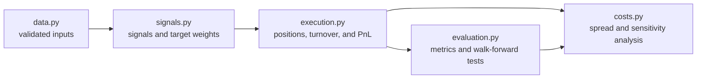

# Research architecture

The reusable research code is split by responsibility so that data handling, signal
formation, execution, transaction costs, and evaluation can be understood and tested
independently. The split changes code ownership only: strategy formulas, parameters,
saved notebook outputs, and published results are unchanged.

## Module boundaries

| Module | Owns | May depend on |
|---|---|---|
| `systematic_crypto.data` | UTC normalization, Parquet I/O, OHLCV audits, outlier flags | NumPy, pandas, PyArrow |
| `systematic_crypto.signals` | research inputs, signals, regime filters, portfolio targets | NumPy, pandas |
| `systematic_crypto.execution` | position evolution, turnover, PnL, strategy orchestration | `signals` |
| `systematic_crypto.evaluation` | diagnostics, summaries, parameter sweeps, walk-forward tests | `execution` |
| `systematic_crypto.costs` | Roll spread estimates and cost-sensitivity experiments | `execution`, `evaluation` |



The modules have no circular imports. Data and signal construction do not know about
performance evaluation, and the execution engine does not select or score its own
parameters.

## Public imports

New code should import from the module that owns the behavior:

```python
from systematic_crypto.data import audit_ohlcv
from systematic_crypto.execution import run_execution_engine
from systematic_crypto.evaluation import summarize_strategy_state
```

The package root also exposes the complete supported API:

```python
from systematic_crypto import ensure_utc_index, run_execution_engine
```

`strategy_helpers.py` remains as a deliberately small compatibility facade. The saved
research notebook and any downstream code using historical imports continue to work:

```python
from strategy_helpers import ensure_utc_index
```

Tests assert that every compatibility export is the same Python object as its package
equivalent, preventing the two import surfaces from drifting.
