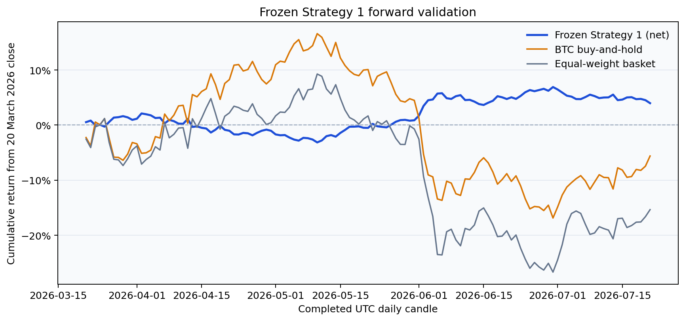

# Strategy 1 forward snapshot — 21 July 2026

> **Superseded:** this first snapshot started the backtest index on 1 January 2020 instead of the submitted notebook's return-aligned 2 January start. That shifted the fixed 10-day rebalance phase. The artifacts are retained for auditability, but the [corrected snapshot](../2026-07-21-corrected/README.md) should be used for results.

This is the first dated evaluation after the original 20 March 2026 research cutoff. The selected Strategy 1 specification was not changed or re-estimated.

| Metric | Forward result |
|---|---:|
| Window | 21 Mar – 21 Jul 2026 |
| Completed daily observations | 123 |
| Net return from cutoff equity | **3.98%** |
| Annualised return | 8.32% |
| Sharpe ratio | **1.053** |
| Sortino ratio | 1.883 |
| Maximum drawdown | **−5.15%** |
| Net PnL | **+1,468.36 USDT** |
| Transaction costs | 228.91 USDT |
| BTC buy-and-hold return | −5.61% |
| Equal-weight basket return | −15.34% |

The strategy remained active on every forward day. Although average absolute exposure was concentrated in BTC, gross PnL came mainly from ETH (+940.50 USDT) and BNB (+567.88 USDT); BTC contributed +149.30 USDT and ADA +39.60 USDT before aggregate transaction costs.

The snapshot contains:

- [`summary.json`](summary.json): specification, hashes, provenance, metrics, benchmarks, and asset diagnostics;
- [`daily.csv`](daily.csv): daily PnL, costs, turnover, exposures, equity, and per-asset gross attribution.
- [`cumulative_returns.png`](cumulative_returns.png): net performance against BTC and an equal-weight basket.

This short positive window is encouraging but not decisive. It is preserved as new forward evidence and does not replace or extend the original model-selection sample or holdout.
